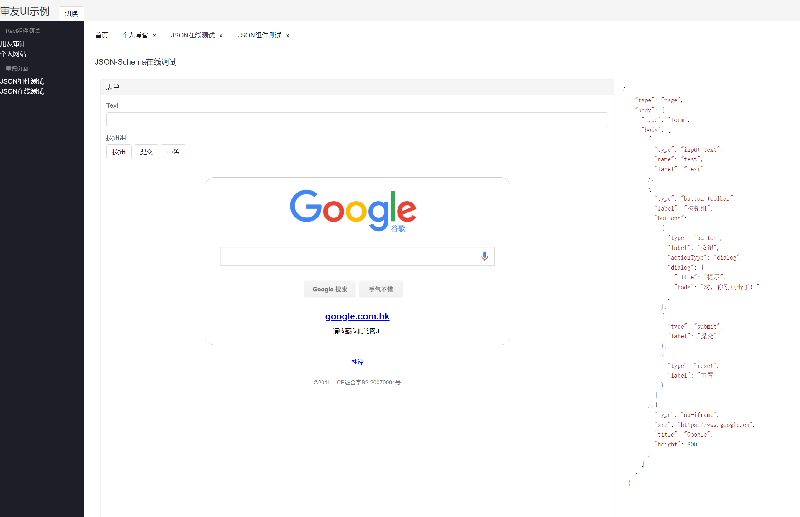

# AIP Web Template

`AIP`(Audit Information Platform) 前端模板项目。

项目是基于[Create React App](https://github.com/facebook/create-react-app)构建的。

## 依赖

- NodeJS v14+
- React 16.8.6
- AMIS 1.6.0
- TypeScript 4.5.4

> 为了不出现各种意想不到的问题（浪费排查时间），建议按照推荐版本号配置开发环境

## 构建脚本

进入项目根目录，执行：

### `npm start`

项目以 `development` 模式启动，可以通过浏览器访问：[http://localhost:3000](http://localhost:3000)

当您的文件更新的时候，页面会自动更新。

### `npm run build`

将项目构建到 `build` 目录下，这是 `product` 模式，可发布的版本。

更多信息可以查看 [deployment](https://facebook.github.io/create-react-app/docs/deployment)

## FAQ

1. 提示错误: Error while creating new React app ("You are running `create-react-app` 4.0.3, which is behind the latest release (5.0.0)")

运行命令
~~~bash
npx clear-npx-cache
~~~
可以清除npx缓存然后再构建。

## Snapshot

